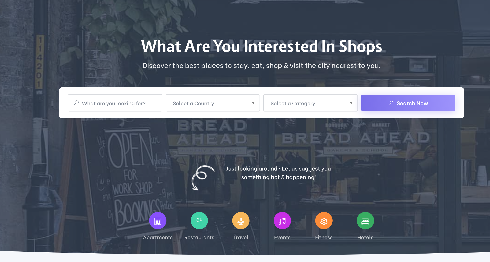
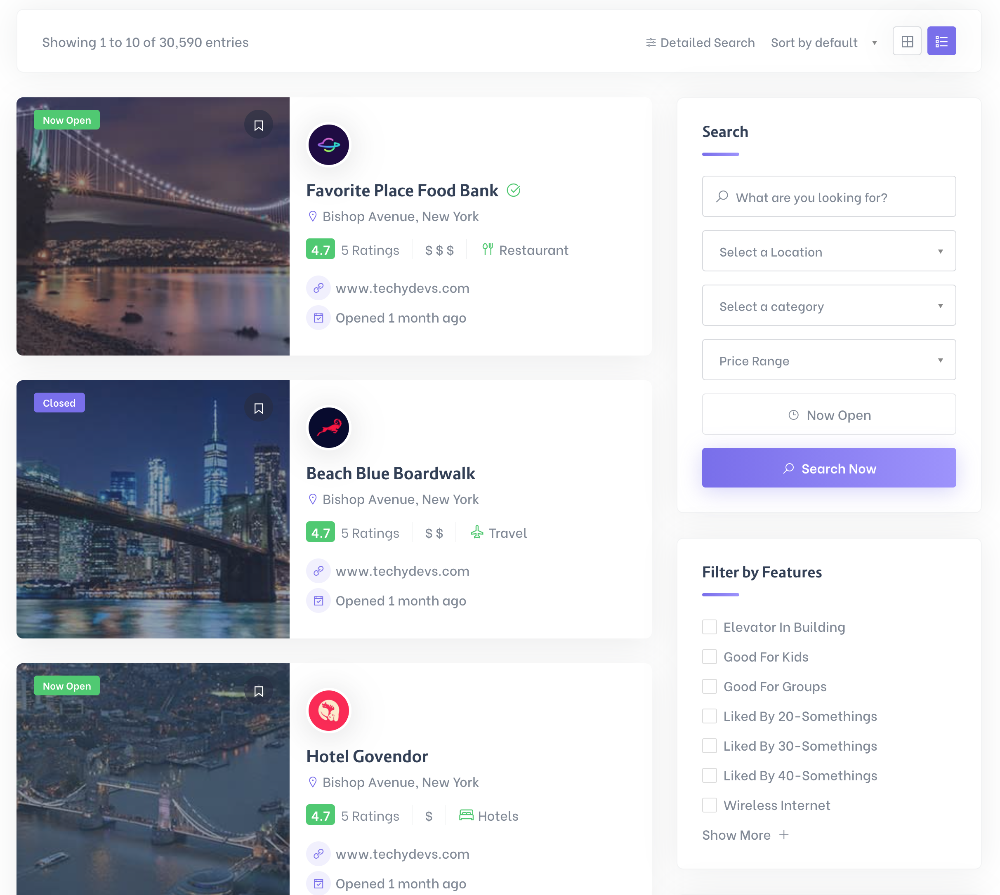
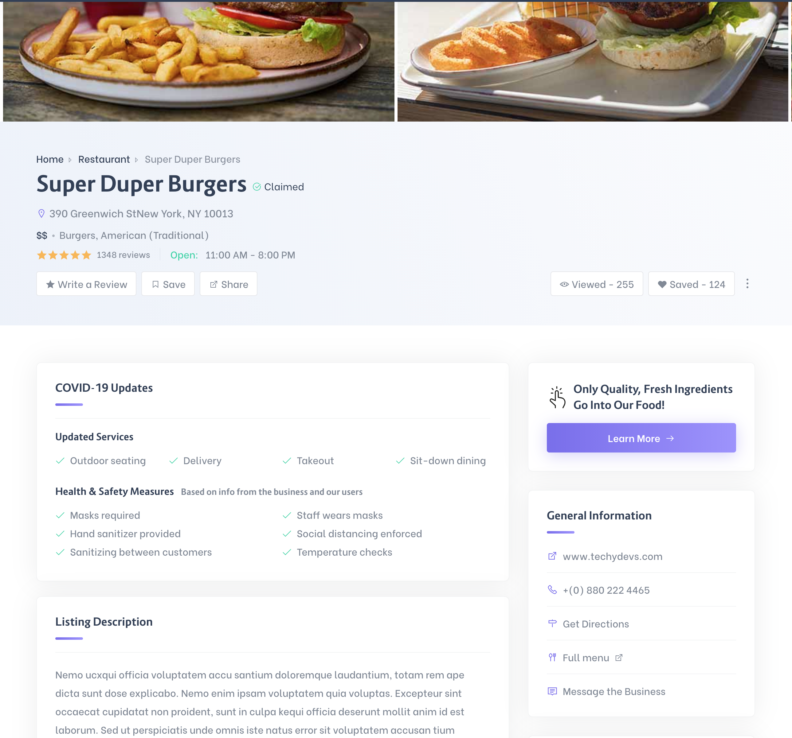
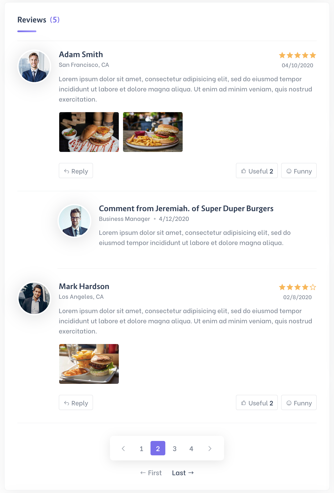
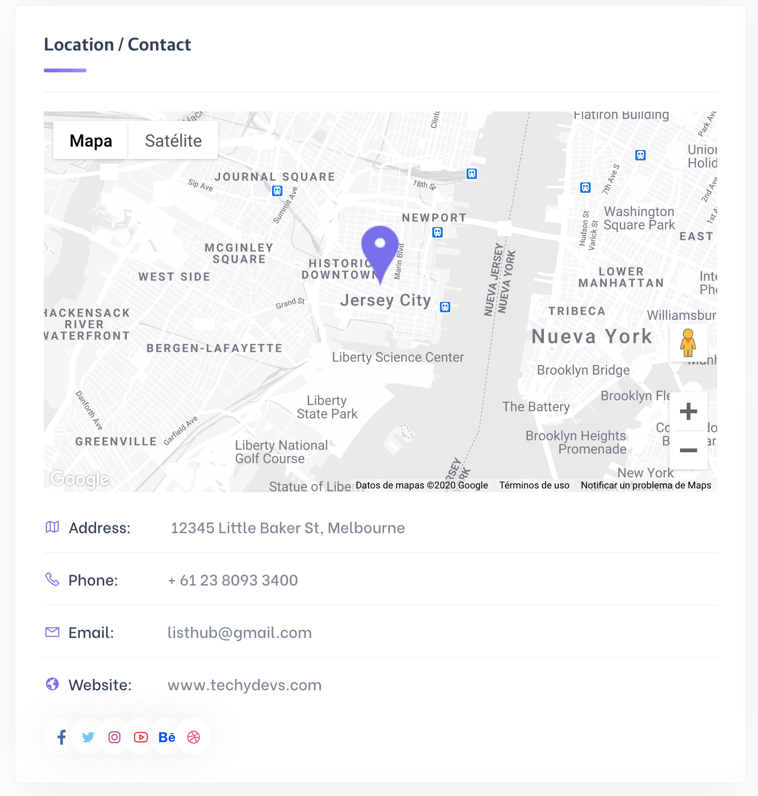

# Frontend Developer Challenge

The assignment is designed to check your coding and problem-solving skills. We are more interested in Architecture, Domain model design and Markup skills than in tooling setup.

What we evaluate in the code:

- Modularity
- Code organization
- Exception handling and logging
- Writing and organizing tests
- Asynchronous programming
- Components and Minimalism

The challenge is a basic listing page, it allows you to search, add, update and remove business.

## Requirements

### Listing

The application must have a search engine that allows you to search for a business depending on the city or category

### Results

The results must be shown depending on the score that the business has at the time of the search

### Profile

The business profile should show the main information of the business.

### Comments

Users must be able to leave comments about the business

### Address on Map

In the business profile, the location should be shown on a map of your choice.

## Tools

1. Use [Angular 10+](https://angular.io/) or [Vue.js 3+](https://v3.vuejs.org/) to setup the project.
2. Use Typescript.
3. Use [TailwindCSS](https://tailwindcss.com/) or [Boostrap 4+](https://getbootstrap.com/) to style the components.
4. Use this [Test API](https://5fcfc9341f23740016630db3.mockapi.io/api/v1/business) to get the application's data.

# Derivables

1. Use [Azure](https://azure.microsoft.com/en-us/) as plataform to deploy.

### Nice to have (not required)

1. Use an strategy to paginate the API results
2. Dockerize and deploy your application using GitHub Actions
